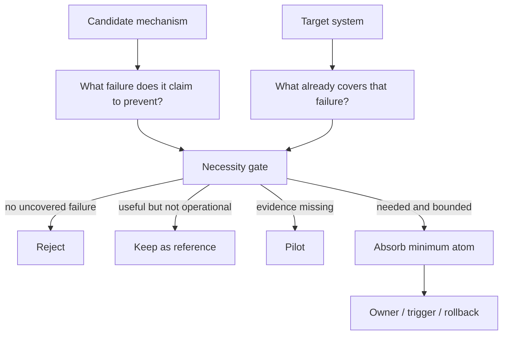

<!-- Language switch -->
**English** | [中文](./README.zh.md)

# candidate-fit-review

**Decide whether a proposed mechanism actually belongs in a target system.**

`candidate-fit-review` is for one decision: should candidate A be absorbed into target B? It does not summarize A, sell A, or reward novelty. It asks whether B has a real uncovered failure, whether A is necessary, and what the smallest reversible integration would be.

Use it before adding a rule, workflow, abstraction, checklist, skill, process, or governance layer to an existing system.



## The Test

A candidate is worth absorbing only when all three statements are true:

1. The target has a concrete failure the current system does not handle.
2. The candidate handles that failure better than a simpler local fix.
3. The integration can be bounded, owned, triggered, and rolled back.

If any statement fails, the answer should be no, reference-only, or pilot-first.

## Review Output

The review ends with one recommendation:

| Outcome | Meaning |
| --- | --- |
| Do not absorb | No real uncovered failure or the cost is unjustified |
| Keep as reference | Useful idea, but not a rule or workflow yet |
| Pilot | Promising, but needs evidence under real conditions |
| Absorb minimum atom | Add the smallest useful piece with owner and rollback |
| Replace existing mechanism | Use only when the candidate clearly dominates current coverage |

## Quick Start

```text
Use candidate-fit-review. Candidate A is [mechanism]. Target B is [system]. Decide whether B should absorb A, and if yes, identify the smallest safe integration point.
```

Expected answer:

- the real problem claim;
- current coverage in B;
- benefit, cost, and overlap;
- simpler alternatives;
- final recommendation and rollback path.

## When Not To Use It

Do not use this skill for general product research, feature comparison, or implementation planning after the decision has already been made. It is a fit review, not a build plan.

## License

MIT.
