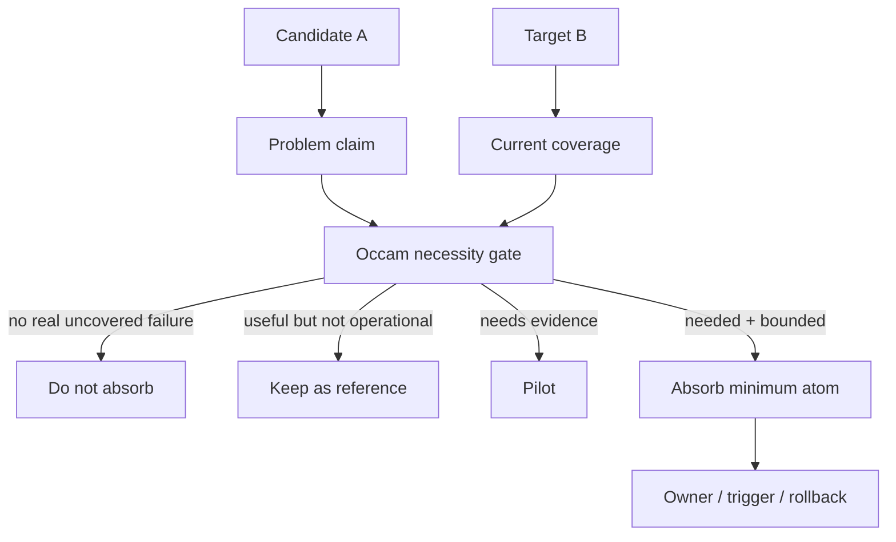

# candidate-fit-review

**A necessity-first review for deciding whether a candidate mechanism belongs in a system.**

Good mechanisms are still bad additions when they solve no real problem. Teams
often absorb a rule, workflow, abstraction, or framework because it is polished,
popular, or locally useful somewhere else. The result is more vocabulary, more
maintenance, and less clarity about which mechanism is actually responsible for
which failure.

`candidate-fit-review` is a skill for judging whether candidate A should enter
target B. It starts from the failure B needs to prevent, then asks whether A is
necessary, whether existing coverage already handles the failure, and what the
smallest reversible integration point would be.



> **Design stance:** the review is not a feature tour. It is a decision about
> necessity, fit, cost, and the smallest atomic change that can be evaluated.

<details>
<summary>Table of contents</summary>

- [The problem](#the-problem)
- [Why this exists](#why-this-exists)
- [How it works](#how-it-works)
- [Quick start](#quick-start)
- [Core concepts](#core-concepts)
- [Recommendation outcomes](#recommendation-outcomes)
- [When to use it - and when not to](#when-to-use-it---and-when-not-to)

</details>

---

## The problem

Absorption decisions fail when the review starts with the attractiveness of A
instead of the actual need inside B:

- A is good, but B has no recurring failure that requires it;
- A duplicates an existing mechanism and creates two sources of truth;
- A solves a speculative future issue but adds current maintenance cost;
- a whole framework is imported when one small rule or check would be enough;
- old mechanisms are removed before their dependents are understood.

`candidate-fit-review` keeps the decision grounded in real failures, current
coverage, and minimum necessary change.

## Why this exists

Most fit reviews ask:

> *Is this candidate good?*

This skill asks a stricter question:

> *What makes any change necessary for the target, and is this candidate the
> smallest clear way to cover that need?*

That framing keeps Occam's razor from becoming a shallow "smaller diff is
always better" rule. The correct change is the one that removes unnecessary
entities while still solving the real problem.

## How it works

The review follows a fixed decision path:

1. Define candidate A and target B.
2. Name the concrete failure B needs to prevent.
3. Check whether the failure is real, recurring, high-impact, or likely enough.
4. Inspect B's current coverage and dependents.
5. Compare A against simpler alternatives.
6. Decide the minimum atom: reference, pilot, rule, workflow step, checker,
   adapter, replacement, or no change.
7. State the recommendation with confidence and residual risk.

The conclusion is allowed to be weak when inputs are weak. It should not pretend
that missing definitions are known.

## Quick start

Use the skill when evaluating absorption:

```text
Use candidate-fit-review to judge whether mechanism A should be introduced into
system B. Start from the failure B needs to prevent, then recommend whether to
reject, keep as reference, pilot, absorb, or replace something.
```

Useful inputs:

- candidate A;
- target B;
- the observed failure or motivation;
- current mechanisms in B;
- expected owner or reader;
- constraints, costs, and downstream dependents.

## Core concepts

| Concept | Meaning |
| --- | --- |
| Necessity gate | A change must prevent a real uncovered failure |
| Current coverage | What B already does before A is introduced |
| Minimum atom | The smallest independently evaluable unit worth adding |
| Hidden cost | Explanation, maintenance, conflict, and memory burden |
| Reference-only | Useful background that should not become procedure or state |
| Chesterton check | Do not remove an existing mechanism before understanding why it exists |

## Recommendation outcomes

| Outcome | Use when |
| --- | --- |
| Do not absorb | A adds vocabulary or completeness without a real uncovered failure |
| Keep as reference | A is useful context but should not govern execution |
| Pilot | The need is plausible but evidence or ownership is not mature |
| Absorb minimum atom | A covers a real gap and can enter as a bounded unit |
| Replace | A clearly supersedes an existing mechanism after dependents are understood |

## When to use it - and when not to

**Use `candidate-fit-review` when you are thinking:**

- "Should we absorb this rule, workflow, or design?"
- "Is this new mechanism actually necessary?"
- "Should this be a formal process, a reference, or nothing?"
- "What is the smallest reversible way to introduce this?"

**Do not use it** for immediate implementation, open-ended brainstorming,
simple summaries, or cases where there is no concrete candidate and target.
