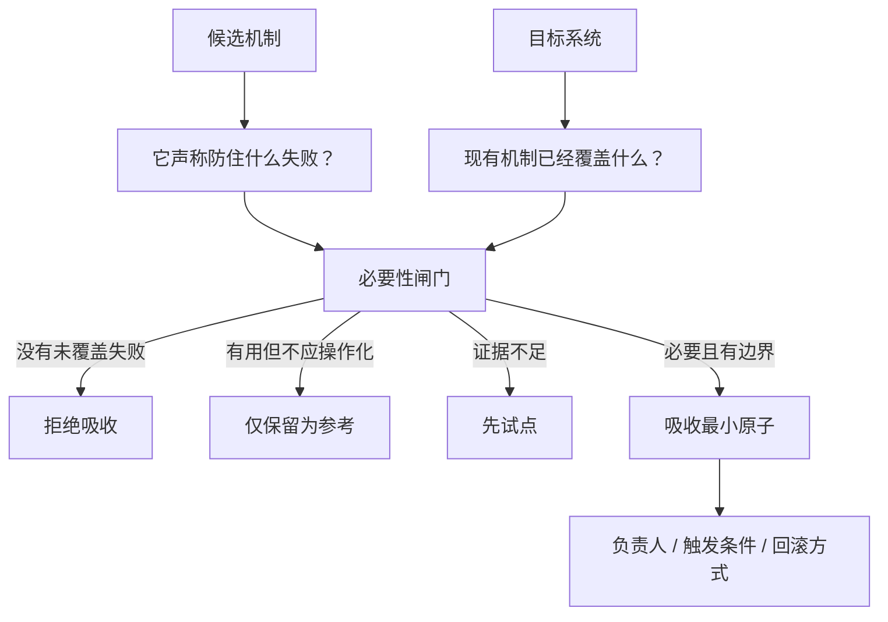

<!-- Language switch -->
[English](./README.md) | **中文**

# candidate-fit-review

**判断一个候选机制是否真的应该进入目标系统。**

`candidate-fit-review` 只服务一个决策：候选 A 要不要被目标 B 吸收？它不替 A 做介绍，不替 A 做推销，也不奖励“看起来先进”。它只问：B 是否有真实未覆盖失败？A 是否必要？最小且可回退的接入点是什么？

当你准备把规则、流程、抽象、清单、skill、治理层或工作方式加入既有系统时，先用它判断是否值得吸收。



## 判断标准

只有同时满足三件事，才值得吸收：

1. 目标系统存在一个当前机制防不住的具体失败。
2. 候选机制比更简单的本地修补更适合处理这个失败。
3. 接入点可以被限定、负责、触发和回滚。

任一条件不成立，结论就应是拒绝、仅参考，或先试点。

## 评审结论

评审最终只给一个推荐：

| 结论 | 含义 |
| --- | --- |
| 不吸收 | 没有真实未覆盖失败，或成本不值得 |
| 仅保留为参考 | 想法有价值，但还不该变成规则或流程 |
| 先试点 | 有潜力，但需要真实条件下的证据 |
| 吸收最小原子 | 只加入最小有用部分，并明确负责人和回滚 |
| 替换现有机制 | 只有候选机制明显优于现有覆盖时才使用 |

## 快速开始

```text
Use candidate-fit-review. Candidate A is [mechanism]. Target B is [system]. Decide whether B should absorb A, and if yes, identify the smallest safe integration point.
```

预期输出：

- 真实问题主张；
- B 的当前覆盖；
- 收益、成本和重叠；
- 更简单的替代方案；
- 最终建议和回滚路径。

## 何时别用

不要把它用于普通产品调研、功能对比，或已经决定要做之后的实现规划。它是适配性评审，不是建设方案。

## 许可证

MIT。
