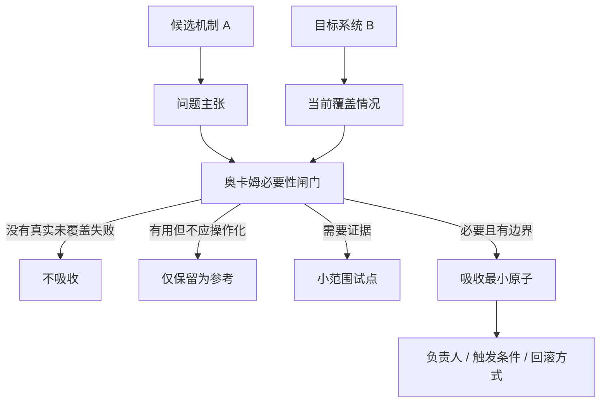

<!-- Language switch -->
[English](./README.md) | **中文**

# candidate-fit-review

**一种必要性优先的评审方法,用于判断候选机制是否应该进入某个系统。**

好机制也可能是不该加入的机制。团队常常因为某个规则、流程、抽象或框架看起来成熟、
流行、或在别处有用,就把它吸收到自己的系统里。结果是词汇更多、维护更多,而谁负责
防住哪个失败反而更不清楚。

`candidate-fit-review` 用来判断候选 A 是否应该进入目标 B。它先问 B 需要防住的失败是
什么,再判断 A 是否必要、现有覆盖是否已经足够、以及最小且可回退的接入点是什么。



> **设计立场:** 这不是功能巡礼,而是关于必要性、适配度、成本,以及最小可评估变更单元的
> 决策。

<details>
<summary>目录</summary>

- [问题](#问题)
- [为什么有它](#为什么有它)
- [它怎么工作](#它怎么工作)
- [快速开始](#快速开始)
- [核心概念](#核心概念)
- [推荐结论](#推荐结论)
- [何时用、何时别用](#何时用何时别用)
- [许可证](#许可证)

</details>

---

## 问题

吸收决策如果从 A 的吸引力开始,而不是从 B 的真实需要开始,就容易失败:

- A 是好的,但 B 没有需要它处理的反复失败;
- A 复制了既有机制,制造两个事实来源;
- A 解决的是假想未来问题,却增加了当前维护成本;
- 本来只需要一条小规则或检查,却导入了整个框架;
- 旧机制被移除前,没人理解它为什么存在、谁依赖它。

`candidate-fit-review` 把决策压回真实失败、当前覆盖和最小必要变更。

## 为什么有它

多数 fit review 问的是:

> *这个候选物好吗?*

这个 skill 问的是更严格的问题:

> *目标系统为什么必须改变?这个候选物是不是覆盖该需要的最小清晰方式?*

这个框架避免把奥卡姆剃刀误用成"diff 越小越好"。正确的变更,是去掉不必要实体,同时仍然
解决真实问题的变更。

## 它怎么工作

评审走固定决策路径:

1. 定义候选 A 和目标 B。
2. 命名 B 需要防住的具体失败。
3. 判断这个失败是否真实、反复、高影响或足够可能。
4. 检查 B 当前的覆盖和依赖者。
5. 比较 A 与更简单替代方案。
6. 决定最小原子:reference、pilot、rule、workflow step、checker、adapter、replacement
   或 no change。
7. 给出推荐、信心强度和残余风险。

输入弱时,结论也允许弱。不要假装缺失定义已经被知道。

## 快速开始

评估是否吸收某个机制时使用:

```text
Use candidate-fit-review to judge whether mechanism A should be introduced into
system B. Start from the failure B needs to prevent, then recommend whether to
reject, keep as reference, pilot, absorb, or replace something.
```

有用输入:

- candidate A;
- target B;
- 已观察到的失败或动机;
- B 当前机制;
- 预期 owner 或 reader;
- 约束、成本和下游依赖。

## 核心概念

| 概念 | 含义 |
| --- | --- |
| Necessity gate | 变更必须防住真实且未覆盖的失败 |
| Current coverage | A 进入前,B 已经能做什么 |
| Minimum atom | 值得加入的最小可评估单元 |
| Hidden cost | 解释、维护、冲突和记忆负担 |
| Reference-only | 有用背景,但不应成为流程或状态 |
| Chesterton check | 理解旧机制为何存在前,不要删除它 |

## 推荐结论

| 结论 | 何时使用 |
| --- | --- |
| Do not absorb | A 主要增加词汇或完整感,没有真实未覆盖失败 |
| Keep as reference | A 是有用背景,但不该治理执行 |
| Pilot | 需要可能存在,但证据或 ownership 未成熟 |
| Absorb minimum atom | A 覆盖真实缺口,且能作为有边界单元进入 |
| Replace | A 明确优于旧机制,且旧机制依赖已被理解 |

## 何时用、何时别用

**当你在想这些时,用 `candidate-fit-review`:**

- "这个规则、流程或设计应不应该被吸收?"
- "这个新机制真的必要吗?"
- "它应该是正式流程、参考资料,还是根本不加?"
- "最小可回退接入方式是什么?"

**不要用它** 做立即实现、开放式头脑风暴、简单摘要,或没有具体候选物和目标对象的判断。

## 许可证

MIT。
